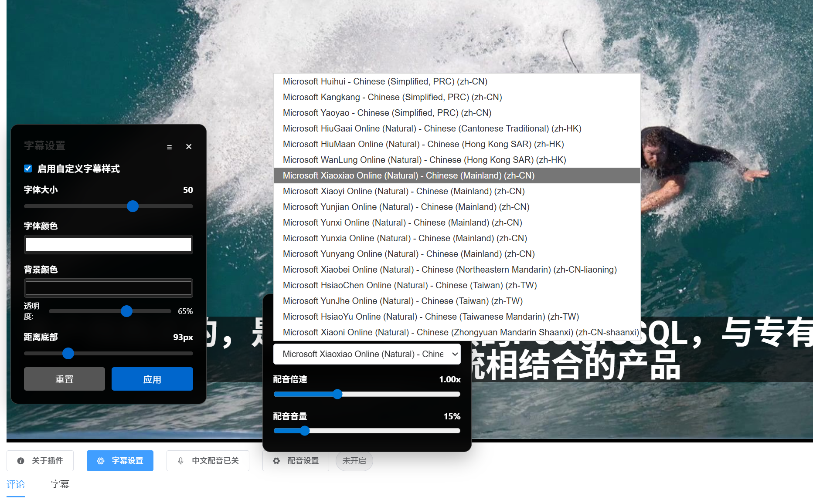

# LuminaEdu 字幕自定义工具

一个 Tampermonkey/Violentmonkey 用户脚本，用于自定义 LuminaEdu 视频字幕的样式。

## 功能特性

- 自定义字幕字体大小（12-40px）
- 自定义字体颜色
- 自定义背景颜色和透明度
- 调整字幕距离底部的距离
- 首次使用自动显示设置面板
- 设置自动保存

## 安装方法

### 方法一：直接安装（推荐）
1. 确保已安装 [Tampermonkey](https://www.tampermonkey.net/) 或 [Violentmonkey](https://violentmonkey.github.io/)
2. 点击此链接安装：[安装链接](https://raw.githubusercontent.com/sangyuxiaowu/luminaedu-video-subtitle/main/luminaedu-subtitle-customizer.user.js)

### 方法二：手动安装
1. 复制脚本代码
2. 打开 Tampermonkey 仪表板
3. 点击"添加新脚本"
4. 粘贴代码并保存

## 使用方法

1. 访问 LuminaEdu 课程页面（以 `/course` 开头的 URL）
2. 首次使用会自动显示设置面板在视频中央
3. 之后可通过页面右上角的"字幕设置"按钮打开面板
4. 调整设置后即时生效

## 界面截图

## 技术细节

- 使用 MutationObserver 监听 DOM 变化
- 使用 GM_setValue/GM_getValue 保存用户设置
- 监听 history API 以支持 SPA 导航
- 使用 !important 确保样式优先级

## 许可证

MIT License - 详见 [LICENSE](LICENSE) 文件